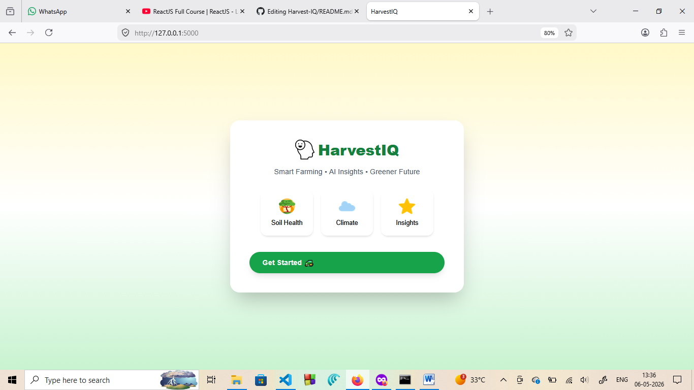
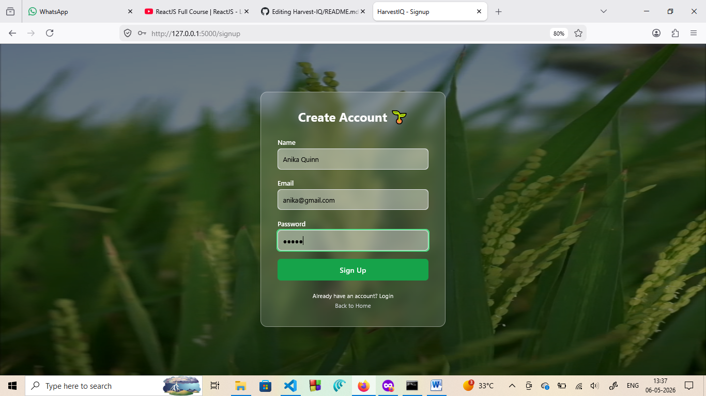
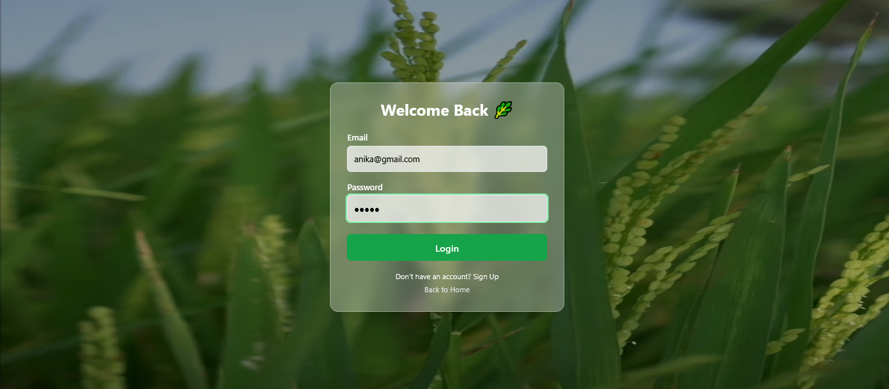
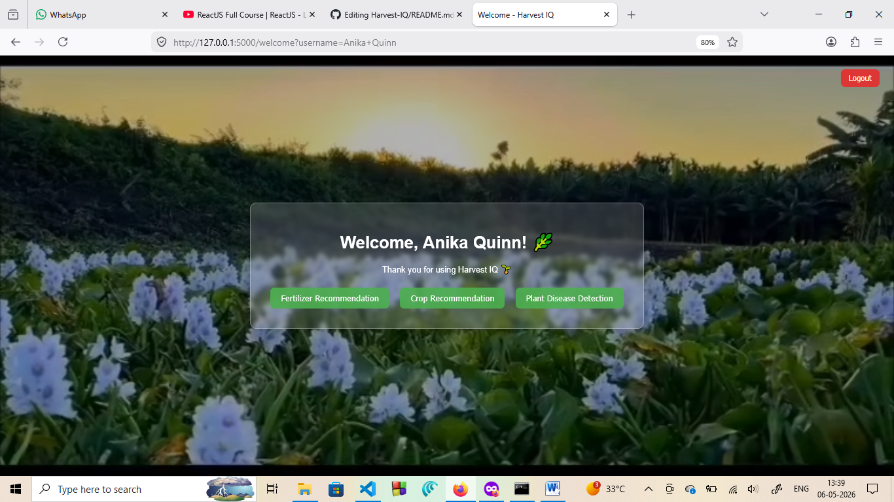
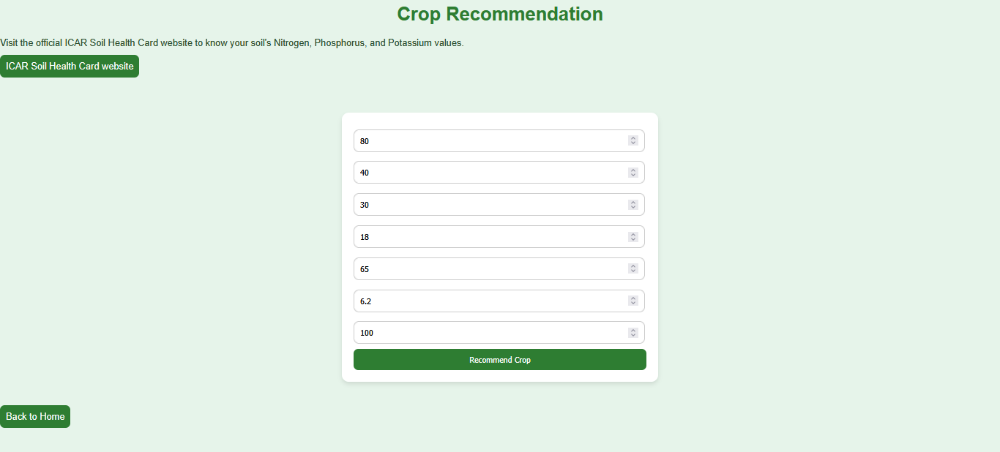
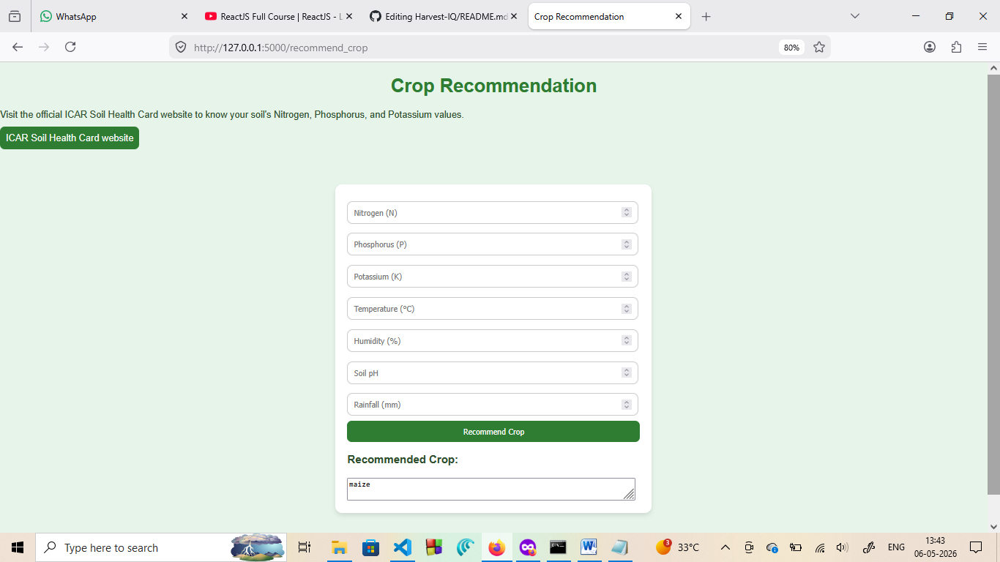
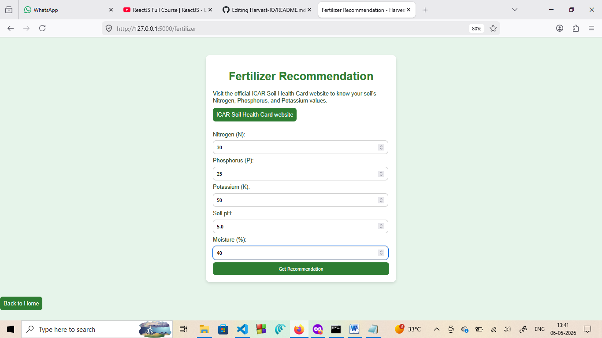
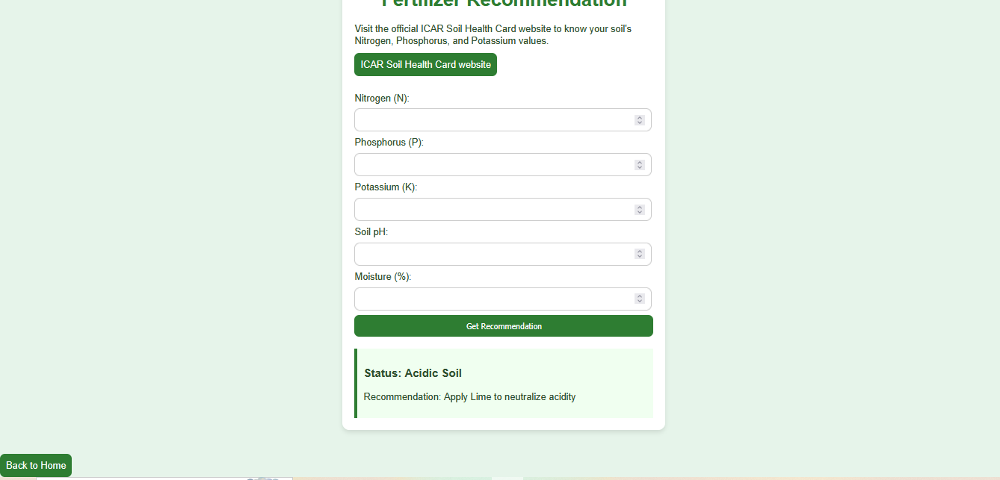
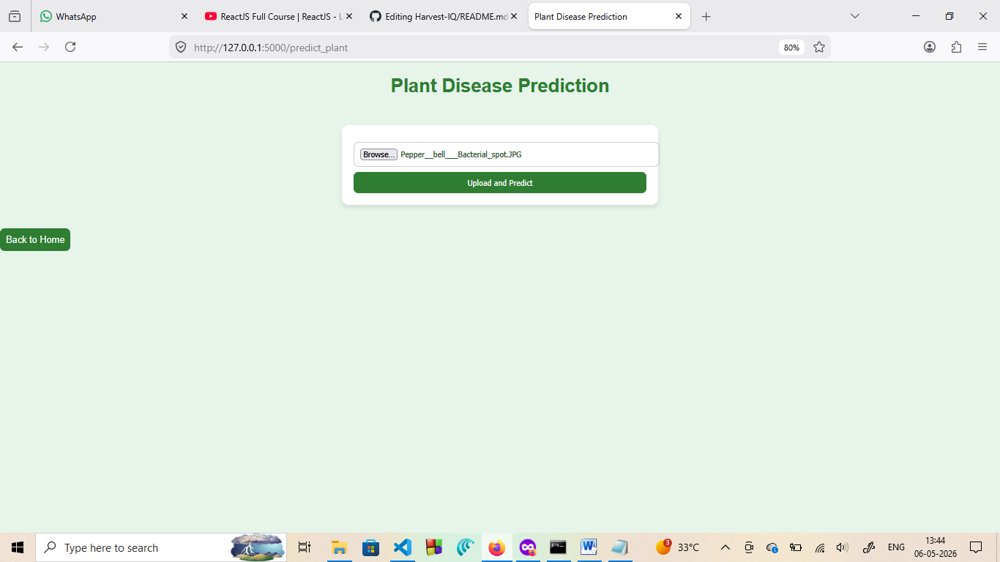
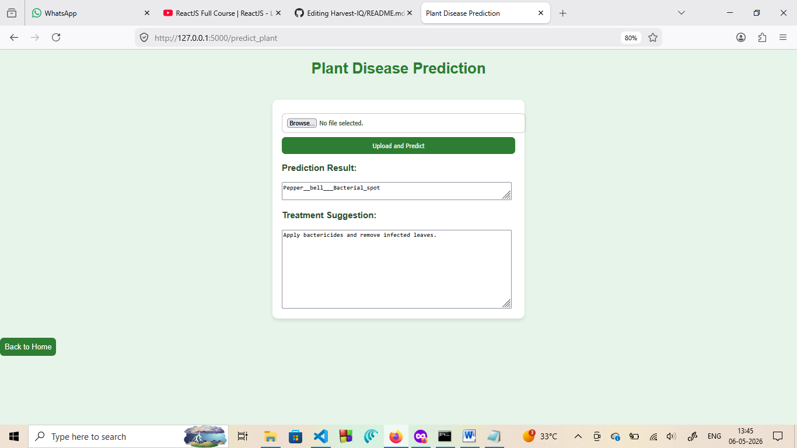

# Harvest-IQ

Smart, data-driven web application designed to help farmers make better decisions on crop selection, disease detection, and fertilizer usage using environmental and image-based inputs.  
All challenges and lessons learned are documented in `/docs/lessons-learned.md`.

---

## Overview

Harvest-IQ provides actionable recommendations by combining environmental data and machine learning models. The system is built to assist in improving crop yield, reducing input costs, and enabling more informed agricultural decisions.

---

# Website Screenshots

## Home Page

## Sign Up Page

## Login Page

## Welcome Dashboard

## Crop Recommendation System
### User fills form details

### Results

## Fertilizer Recommendation System
### User fills form details

### Results

## Plant Disease Detection
### User uploads photo of plant leaf to check if it is healthy or has disease

### Results

---

## Key Features

### Crop Recommendation
- Recommends suitable crops based on environmental parameters  
- Inputs: N, P, K values, temperature, humidity, pH, rainfall  
- Output: Optimal crop suggestion  

### Disease Detection (Image-Based)
- Classifies plant diseases from uploaded images  
- Uses deep learning for prediction  
- Outputs disease type and suggested treatment  

### Fertilizer Recommendation
- Suggests fertilizers based on soil composition  
- Inputs: NPK values, pH, moisture  
- Output: Recommended fertilizers and usage guidance  

---

## Tech Stack

- Frontend: HTML, CSS  
- Backend: Python (Flask)  
- Machine Learning: TensorFlow, Keras  
- Database: PostgreSQL  

---

## System Workflow

1. User inputs environmental data or uploads plant image  
2. Backend processes input through ML models  
3. System generates predictions and recommendations  
4. Results are displayed through a web interface  

---
## Installation and Setup

# Clone the repository
git clone https://github.com/your-username/Harvest-IQ.git

# Move into project directory
cd Harvest-IQ

# Install dependencies
pip install -r requirements.txt

# Run the application
python app.py

---

## Contributors

- Siddhi Kale  
- Neha Jaiswal  
- Samantha Fernandes  

## Notes

This project was developed as part of academic coursework. It demonstrates the integration of web development with machine learning models for real-world problem solving.

## Project Status

This project is currently configured for local development.  
A production deployment version is planned as part of future improvements.
